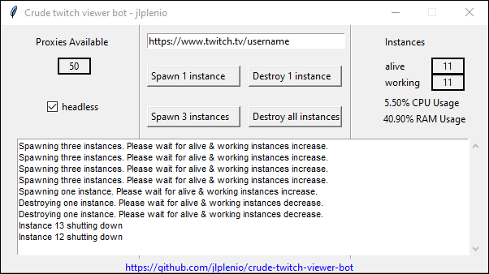

# Crude Twitch Viewer Bot (CTVBot)

>Disclaimer: For educational purpose only. Any discussion of illegal use will be deleted immediately!  
>Full disclaimer below.
### Getting Started
1. Download the one-file executable for Windows, Linux and MacOS from the [latest CTVBot release](https://github.com/jlplenio/crude-twitch-viewer-bot/releases/latest).  
2. Provide your own proxies or get 10 free for testing [here](https://www.webshare.io/?referral_code=w6nfvip4qp3g). See our [Proxies Guide](https://github.com/jlplenio/crude-twitch-viewer-bot/wiki/Webshare.io-Proxies-Guide) for setup.
   
Read the comprehensive [wiki](https://github.com/jlplenio/crude-twitch-viewer-bot/wiki) for a [detailed tutorial](https://github.com/jlplenio/crude-twitch-viewer-bot/wiki/Detailed-Tutorial), [usage tips](https://github.com/jlplenio/crude-twitch-viewer-bot/wiki/Advanced-features-and-controls) and [troubleshooting steps](https://github.com/jlplenio/crude-twitch-viewer-bot/wiki/Troubleshooting).  
Ask questions in the [discussions](https://github.com/jlplenio/crude-twitch-viewer-bot/discussions) or [report issues](https://github.com/jlplenio/crude-twitch-viewer-bot/issues).

Get exlusive Feature Previews as a [:gem: Supporter & Feature Tester](https://ko-fi.com/jlplenio/posts).

### Mandatory Requirements
- You need to provide your own private HTTP proxies to the [proxy_list.txt](proxy/proxy_list.txt)  
  Get 10 free proxies for testing [here](https://www.webshare.io/?referral_code=w6nfvip4qp3g) or follow the [Webshare.io Proxies Guide](https://github.com/jlplenio/crude-twitch-viewer-bot/wiki/Webshare.io-Proxies-Guide).
- Chrome needs to be already installed on your system.

### Platform Support Overview

| Platform              |                                    Twitch                                     |      Youtube       |       Chzzk        |                                     Kick                                      |
|-----------------------|:-----------------------------------------------------------------------------:|:------------------:|:------------------:|:-----------------------------------------------------------------------------:|
| General Functionality |                              :heavy_check_mark:                               | :heavy_check_mark: | :heavy_check_mark: | ⏳[:gem:](https://github.com/jlplenio/crude-twitch-viewer-bot/discussions/256) |
| Lowest Quality Select |                              :heavy_check_mark:                               | :heavy_check_mark: | :heavy_check_mark: | ⏳[:gem:](https://github.com/jlplenio/crude-twitch-viewer-bot/discussions/256) |
| Status Boxes Updates  |                              :heavy_check_mark:                               | :heavy_check_mark: | :heavy_check_mark: | ⏳[:gem:](https://github.com/jlplenio/crude-twitch-viewer-bot/discussions/256) |
| Login/Authentication  | ⏳[:gem:](https://github.com/jlplenio/crude-twitch-viewer-bot/discussions/256) |        :x:         |        :x:         |                                      :x:                                      |
| Automatic Follow      | ⏳[:gem:](https://github.com/jlplenio/crude-twitch-viewer-bot/discussions/256) |        :x:         |        :x:         |                                      :x:                                      |
| Automatic Chat        | ⏳[:gem:](https://github.com/jlplenio/crude-twitch-viewer-bot/discussions/256) |        :x:         |        :x:         |                                      :x:                                      |
| Low CPU Usage Mode    | ⏳[:gem:](https://github.com/jlplenio/crude-twitch-viewer-bot/discussions/256) |        :x:         |        :x:         |                                      :x:                                      |

:heavy_check_mark: Supported, :warning: Problems, :x: Unsupported, ⏳ In Development, [:gem: Preview Available](https://github.com/jlplenio/crude-twitch-viewer-bot/discussions/256) 

### In Action

#### Controls and Color codes of the square boxes

⬛ - Instance is spawned.    🟨 - Instance is buffering.    🟩 - Instance is actively watching.

🖱️ Left click: Refresh page.
🖱️ Right click: Destroy instance.
🖱️ Left click + CTRL: Take screenshot.

### Misc
- CPU load and bandwidth can get heavy. Channels with 160p work best.
- Tested on Windows 10 with headless ~100, headful ~30. Linux and macOS is experimental.

The Crude Twitch Viewer Bot (CTVBot) is a small GUI tool that spawns muted Google Chrome instances via [Playwright](https://github.com/microsoft/playwright-python), each with a different user-agent and HTTP proxy connection. Each instance navigates to the streaming channel and selects the lowest possible resolution.

Read the comprehensive [wiki](https://github.com/jlplenio/crude-twitch-viewer-bot/wiki) for a [detailed tutorial](https://github.com/jlplenio/crude-twitch-viewer-bot/wiki/Detailed-Tutorial), [usage tips](https://github.com/jlplenio/crude-twitch-viewer-bot/wiki/Advanced-features-and-controls) and [troubleshooting steps](https://github.com/jlplenio/crude-twitch-viewer-bot/wiki/Troubleshooting).

Support my creativity and [sponsor me a coffee :coffee:](https://ko-fi.com/jlplenio)

### Full disclaimer
This project was established to contribute to open-source collaboration and showcase the educational value of reverse engineering. Although its primary purpose is for learning and understanding, users must be aware that altering viewer metrics on platforms such as Twitch violates their Terms of Service and could lead to legal repercussions. We urge users to engage with this tool responsibly. Misuse is solely at your discretion and risk. Discussions promoting illegal activities will be promptly removed.

