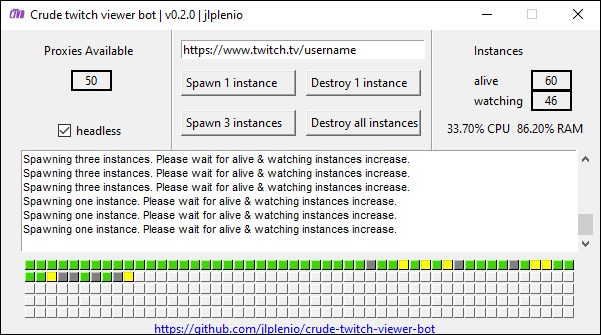

# Crude twitch viewer bot with selenium 

Disclaimer: For educational purpose only!

Small script that spawns muted Google Chrome instances, each with a different user-agent and SOCKS5 proxy connection. 
Each instance navigates to the twitch channel, activates theater mode and adheres itself to the available screen space. 
Settings in localStorage ensure the lowest possible resolution.

### Important
- You need to provide SOCKS 5 proxies to [proxy_list.json](proxy_list.json).   
Buy some at [webshare.io (referred)](https://www.webshare.io/?referral_code=w6nfvip4qp3g). They are quite good. 
- Tested with instance count: Headless ~60, headful ~25.
- Tested on Windows 10 and Chrome Version 97.
- CPU load and bandwidth can get heavy. Channels with 160p work best.

### In action

Headless GUI  


Headful   


### Usage

```
GUI: main_gui.py
```
```
REPL: main.py

Start in REPL and interact with manager through command examples below

Spawn a single instance or multiple with threading:
manager.spawn_instance()
manager.spawn_instances(5)

Delete a single instance or all with threading:
manager.delete_latest()
manager.delete_all_instances()
```


